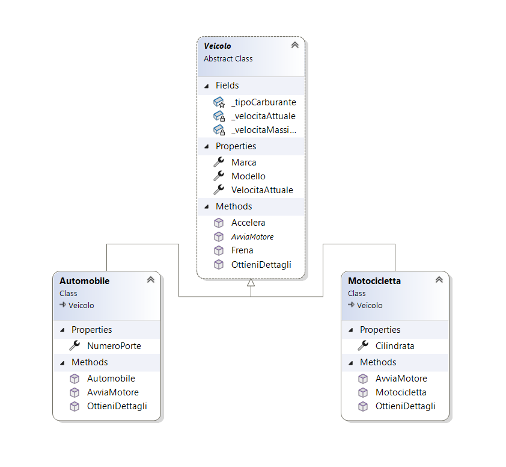

# Progetto Dimostrativo sui 4 Pilastri della OOP in C#

Questo repository contiene un'applicazione console in C# creata per dimostrare in modo chiaro e pratico i quattro principi fondamentali della Programmazione Orientata agli Oggetti (OOP).

Il progetto è strutturato per essere semplice da comprendere e serve come esempio pratico per chiunque voglia approfondire questi concetti chiave.

## Scopo del Progetto

L'obiettivo è fornire un codice sorgente ben commentato che illustri i seguenti pilastri della OOP attraverso un esempio a tema veicoli:

1. **Incapsulamento**
2. **Astrazione**
3. **Ereditarietà**
4. **Polimorfismo**

## I Quattro Pilastri della OOP

Ogni principio è implementato nel codice come segue:

### 1. Incapsulamento 🔒

L'incapsulamento viene dimostrato nella classe base `Veicolo`. I dati sensibili, come `_velocitaAttuale`, sono `private`, mentre l'accesso è controllato tramite proprietà pubbliche (`public int VelocitaAttuale`). 

Il `set` di questa proprietà è `protected`, garantendo che solo la classe stessa o le sue derivate possano modificare lo stato interno in modo controllato.

```csharp
public abstract class Veicolo
{
    private int _velocitaAttuale;
    
    public int VelocitaAttuale 
    { 
        get => _velocitaAttuale; 
        protected set => _velocitaAttuale = value; 
    }
}
```

### 2. Astrazione 🎭

L'astrazione è rappresentata dalla classe `public abstract class Veicolo`. Essendo astratta, non può essere istanziata direttamente. 

Definisce un "contratto" per tutte le classi derivate attraverso il metodo `public abstract void AvviaMotore()`, che obbliga ogni tipo di veicolo a fornire la propria implementazione specifica per l'avvio.

```csharp
public abstract class Veicolo
{
    public abstract void AvviaMotore();
}
```

### 3. Ereditarietà 🧬

L'ereditarietà è evidente nelle classi `Motocicletta` e `Automobile`, che ereditano dalla classe base `Veicolo` usando la sintassi `: Veicolo`. 

In questo modo, acquisiscono tutte le proprietà e i metodi pubblici e protetti della classe padre, estendendoli con funzionalità specifiche (es. `Cilindrata` per la moto).

```csharp
public class Motocicletta : Veicolo
{
    public int Cilindrata { get; set; }
    
    public override void AvviaMotore()
    {
        // Implementazione specifica per motocicletta
    }
}
```

### 4. Polimorfismo 🎪

Il polimorfismo viene messo in pratica nel file `Program.cs`. Una `List<Veicolo>` contiene oggetti di tipi diversi (`Motocicletta` e `Automobile`). 

Quando si itera sulla lista e si invoca un metodo come `veicolo.AvviaMotore()`, il .NET Runtime seleziona dinamicamente l'implementazione corretta (`override`) a seconda del tipo reale dell'oggetto. Questo permette di trattare oggetti diversi in modo uniforme.

```csharp
List<Veicolo> veicoli = new List<Veicolo>
{
    new Motocicletta(),
    new Automobile()
};

foreach (var veicolo in veicoli)
{
    veicolo.AvviaMotore(); // Polimorfismo in azione!
}
```

## Struttura del Progetto

```
📁 Progetto-OOP-Demo/
├── 📄 Program.cs
├── 📄 Veicolo.cs
├── 📄 Motocicletta.cs
├── 📄 Automobile.cs
└── 📄 README.md
```

## Diagramma di Classe (UML)

Il seguente diagramma UML illustra visivamente la struttura delle classi e le loro relazioni:



*Il diagramma mostra la classe astratta `Veicolo` con i suoi campi privati, proprietà pubbliche e metodi. Le classi `Automobile` e `Motocicletta` ereditano da `Veicolo` e implementano le proprie proprietà e metodi specifici.*

## Come Eseguire il Progetto

1. **Clonare il repository**
   ```bash
   git clone [URL_DEL_REPOSITORY]
   cd Progetto-OOP-Demo
   ```

2. **Aprire con Visual Studio**
   - Aprire il file `.sln` con Visual Studio
   - Oppure aprire la cartella con Visual Studio Code

3. **Compilare ed eseguire**
   - Impostare il progetto come progetto di avvio
   - Premere `F5` o il pulsante "Avvia" per eseguire l'applicazione console

## Requisiti di Sistema

- **.NET 6.0** o versioni successive
- **Visual Studio 2022** (consigliato) o **Visual Studio Code**

## Output di Esempio

```
=== Dimostrazione dei 4 Pilastri della OOP ===

Avvio della Motocicletta Honda CBR600RR...
Motore avviato! Cilindrata: 600cc

Avvio dell'Automobile Toyota Corolla...
Motore avviato! Numero porte: 4

Accelerazione di tutti i veicoli...
Motocicletta accelera a 80 km/h
Automobile accelera a 60 km/h
```

## Concetti Chiave Dimostrati

- ✅ **Incapsulamento**: Controllo dell'accesso ai dati
- ✅ **Astrazione**: Definizione di contratti attraverso classi astratte
- ✅ **Ereditarietà**: Riutilizzo e estensione del codice
- ✅ **Polimorfismo**: Comportamento dinamico basato sul tipo

## Contributi

Sentiti libero di contribuire al progetto creando issue o pull request per miglioramenti e correzioni.

## Licenza

Questo progetto è distribuito sotto licenza MIT. Vedi il file `LICENSE` per maggiori dettagli.

---

*Progetto creato a scopo didattico per illustrare i principi fondamentali della Programmazione Orientata agli Oggetti in C#*